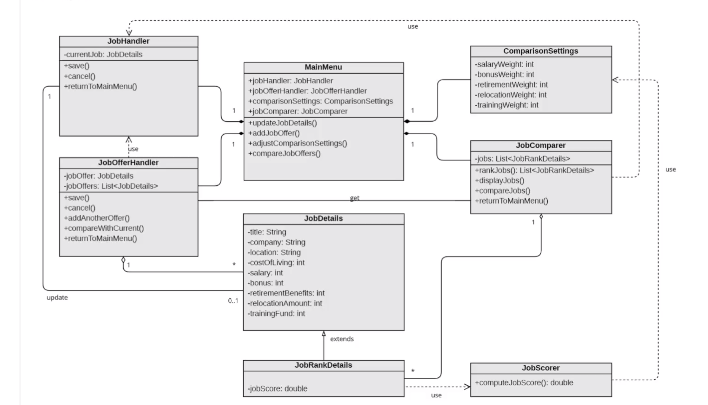
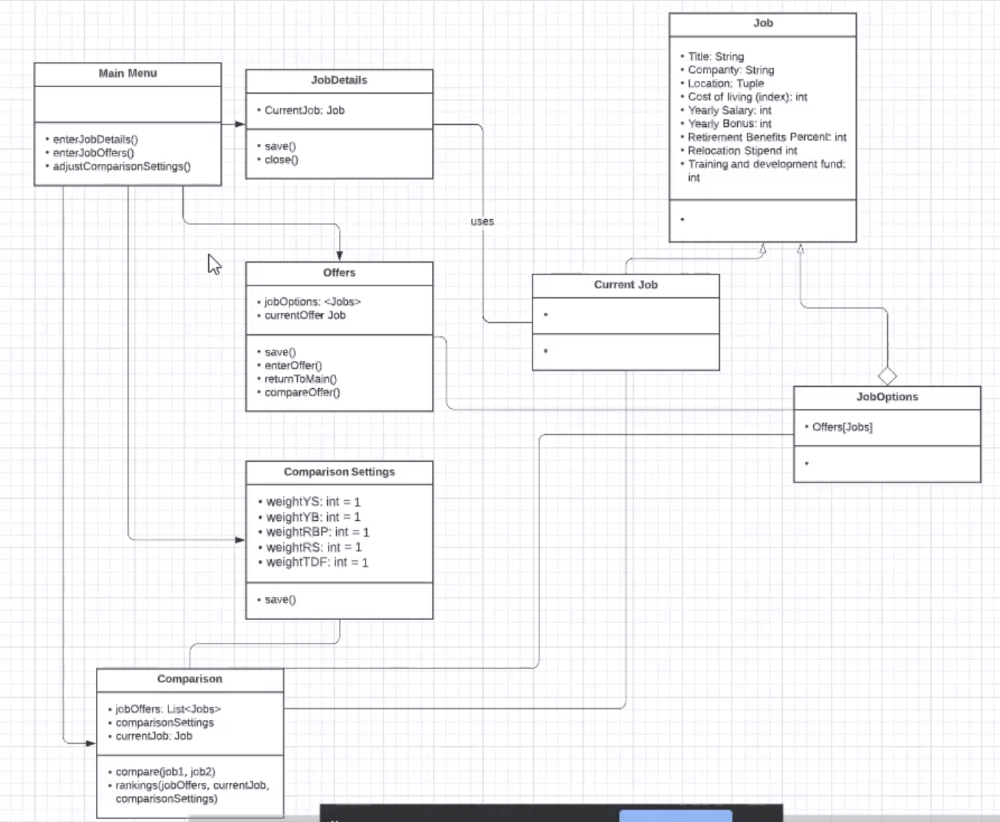
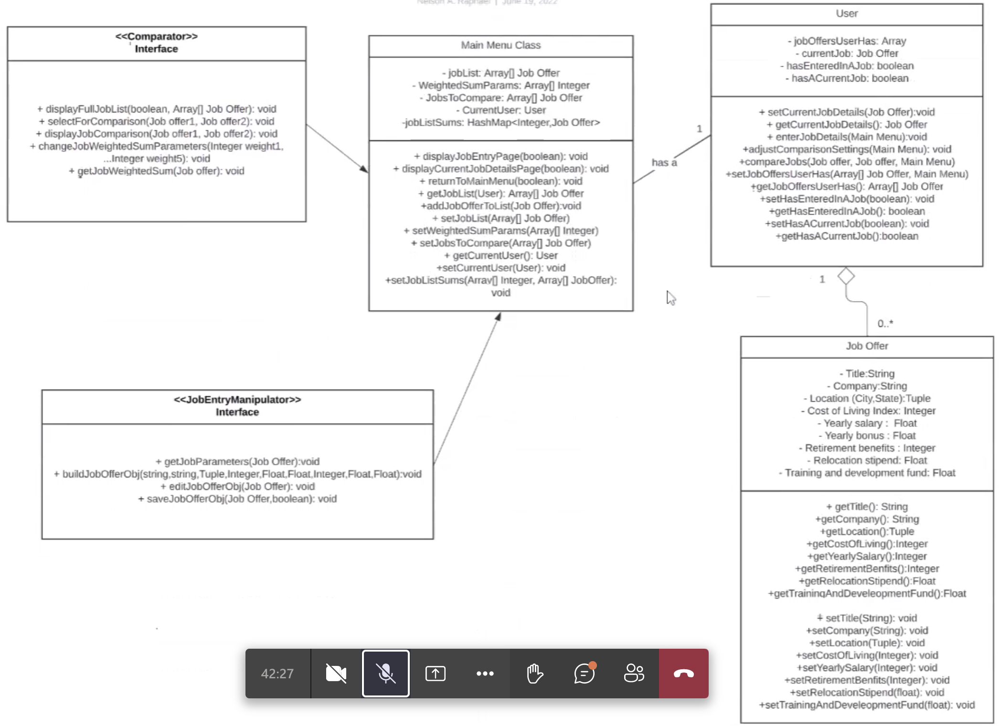
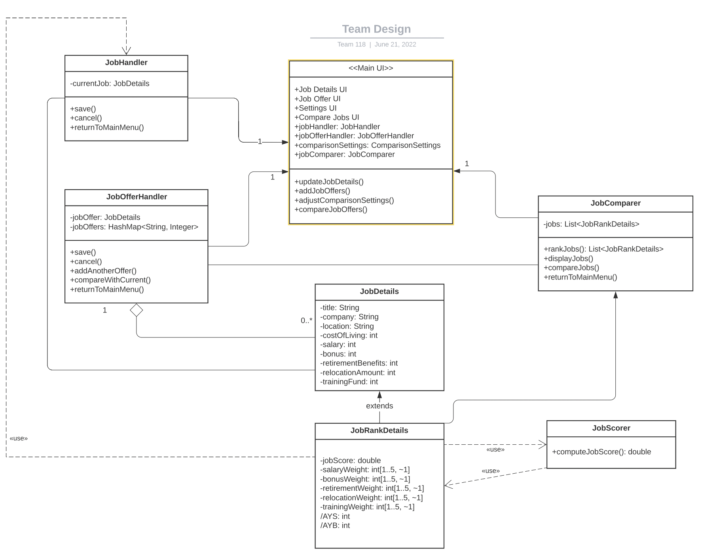

# Design Discussion

## Design 1 [Dan]

### Pros

- Great design simplicity is given through the breakdown of the design and classes.
- This will aid with testing given that all of the classes have no greater than 5 methods.

### Cons
- Some aspects could be combined (Job Comparison settings) even though they were originally split apart.

## Design 2 [William]

### Pros
- Current Job and Job are separate given the Job details interface is required to display current details.
- Separation of the methods for handling job offers as a whole is delegated to the Offers class rather getting lost in a unifying class.
- Current Job exists on its own and inherits the traits of Job, so polymorphism and inheritance utilized.
- Offers can be compared only within the the offers class thus requiring the job offers to be instantiated.

### Cons
- It might not be good for the Comparison class to implement the rankings.
- Lack of presence of how UI is really implemented in this

## Design 3 [Nelson]
 

### Pros
- A very tight design with a minimal amount of classes present here.
- The methods were very thought out for the diagram, where some methods thought 1 and 2 steps ahead.
- The separation between the interface and a class, thus which takes the UI into account in the design.

### Cons
- Some methods may seem redundant in function and take the place of a setter or getter.

## Design 4 [Sege]
 
### Pros

- Explicitly made the UIs within the unifying class as attributes.
- Very one to one with the assignment design requirements and it is straight forward.
- The ranking jobs map idea for sorting against the job score in the map is clever.

### Cons
- The arrow between settings and job details should actually be between settings and ranking jobs.

## Team Design 
 

## Summary

First we decided to start off with Daniel's design as a base, since it incorporated many of the attributes we envisioned for our final design.  Then we wanted to incorporate the jobOffers HashMap in the JobOfferHandler class since it was a clever method of organization and sorting by job score. We also added the UI attributes from Sege's design in the unifying Main Menu class for explicit UI depiction. An original con found in the base design was the need to combine ComaprisonSetting class and the JobComparer class, but we ended up moving the ComparisonSetting class attributes into the JobRankDetails class to decrease the number of classes we had. This made the design a bit more intuitive given the relationship between the classes of JobScorer and JobComparer. Next we added in two additional derived attributes (AYS and AYB) to JobRankDetails for the equation computing the JobScore, that were previously absent. Lastly, we illustrated the constraint for the weighted integers within the diagram within the JobRankDetails class.
