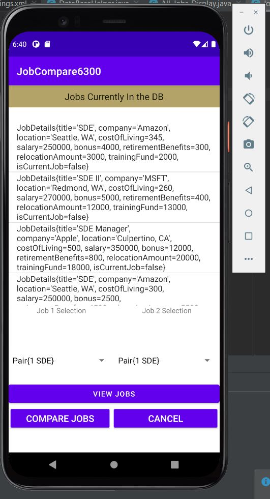

# Design Document

**Author**: Team 118

## 1 Design Considerations

### 1.1 Assumptions

The software is assumed to be used by employed users who mainly range between ages 18-65. Design has to be inclusive to a large age population. The software depends on users having access to an android-applicable device. The software does not depend on internet connection or cellular data. One assumption of the software is that it will have the fully functional features that are required of it. 

### 1.2 Constraints

- Platform - The system is limited in the platforms it can be on. The software will be developed in Android Studio, and be meant for android applicable devices.
- User - The user can only have one current job, reflecting the real world scenario. 
- Features - The application, as per the design, only has 4 features (edit or enter current job, enter job offers, change comparison settings, compare job offers).

### 1.3 System Environment

The system has to be run on hardware that runs on the Android OS. Specifically, the minimum API level is Android 11.0.

## 2 Architectural Design

*The architecture provides the high-level design view of a system and provides a basis for more detailed design work. These subsections describe the top-level components of the system you are building and their relationships.*

### 2.1 Component Diagram

*This section should provide and describe a diagram that shows the various components and how they are connected. This diagram shows the logical/functional components of the system, where each component represents a cluster of related functionality. In the case of simple systems, where there is a single component, this diagram may be unnecessary; in these cases, simply state so and concisely state why.*

### 2.2 Deployment Diagram

*This section should describe how the different components will be deployed on actual hardware devices. Similar to the previous subsection, this diagram may be unnecessary for simple systems; in these cases, simply state so and concisely state why.*

## 3 Low-Level Design

*Describe the low-level design for each of the system components identified in the previous section. For each component, you should provide details in the following UML diagrams to show its internal structure.*

### 3.1 Class Diagram

*In the case of an OO design, the internal structure of a software component would typically be expressed as a UML class diagram that represents the static class structure for the component and their relationships.*

### 3.2 Other Diagrams

*<u>Optionally</u>, you can decide to describe some dynamic aspects of your system using one or more behavioral diagrams, such as sequence and state diagrams.*

## 4 User Interface Design

- Here are a the images of our current application's guided user interfaces.

### Main Menu

- Here is the main menu UI for our application, also known as our main entry point. The user will have four options (truly only three if no job offers have been entered yet). 

### Update Current Job

- Here is the UI for updating the user's current job. The goal is to have this automatically set the entry to the current job and release the prior current job's designation.

### Job Entry

- Here is the UI for just entering in job offers received. Using the switch at the bottom the user can designate if the job being entered will be the new current job, rather than the automatic designation presented in the Update_Current_Job UI.

### Adjust Settings Page

- Here is the UI for adjusting the settings of the integer weights. We decided to go with a slider to constrain the types of inputs available for the user.

### All Jobs Page

- Here is the All Jobs page that is present when you want to initiate a comparison, but need to look at the jobs that need to be compared.

- There are two spinners present under the list view that will populate with the job titles and the id numbers once the user chooses to view all.

- Here is how it looks populated.

### Job Comparison

- Here is the UI for performing the job comparison. This is behind the All_Jobs_Display UI since you have to select the jobs using the spinners for it to be ported over to the comparison table.
- The "Go Back" button provides the user a way to return to the main menu.

