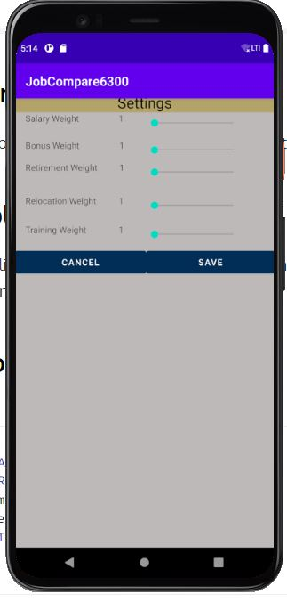
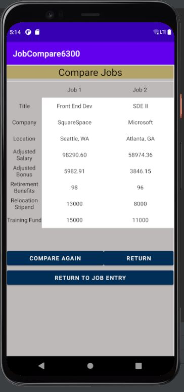

# Design Document

**Author**: Team 118

## 1 Design Considerations

### 1.1 Assumptions

The software is assumed to be used by employed users who mainly range between ages 18-65. Design has to be inclusive to a large age population. The software depends on users having access to an android-applicable device. The software does not depend on internet connection or cellular data. One assumption of the software is that it will have the fully functional features that are required of it. 

### 1.2 Constraints

- Platform - The system is limited in the platforms it can be on. The software will be developed in Android Studio, and be meant for android applicable devices.
- User - The user can only have one current job, reflecting the real world scenario. 
- Features - The application, as per the design, only has 4 features (edit or enter current job, enter job offers, change comparison settings, compare job offers).

### 1.3 System Environment

The system has to be run on hardware that runs on the Android OS. Specifically, the minimum API level is Android 11.0.

## 2 Architectural Design

### 2.1 Component Diagram

Within this component diagram you can see the application interfaces, the database, as well as the user present. The pipes are substituted for the regular component connections due to the application used to create it, but it represents the same relationship where the child item can not exist without the parent (i.e. these other interfaces can not exist without the existence of the main interface). These lines also detail the relationship of why that component is invoked when leaving the parent and show features that branch off as actions that can be taken as a final action before return or that result in a displayed view.

The database component as well as its dependencies are shown, where the relationship between the Job Entry UI, Update Current Job UI, and All Job Display UI need the Database to function correctly. While they can exist without the database as a static interface, the baseline functionality will be missing due to an inability to access database entries to be displayed, updated, deleted or compared. 

The Job Compare UI can not exist without the All Job Display, which is tied back to the Main Menu UI. This is also tied to the database, since the entries being compared will orignate from there first after being sorted by the job score and parsed for just the title and company columns.

### 2.2 Deployment Diagram

There are two different components at play here for this application. There will be the SQLiteDatabase as well as the application itself. The database is deployed directly onto the device hosting the app, since it is built into the android backend. There is no need for an elaborate diagram since it is a fully contained system. We are not running a multi-device distributed system.

## 3 Low-Level Design

*Describe the low-level design for each of the system components identified in the previous section. For each component, you should provide details in the following UML diagrams to show its internal structure.*

### 3.1 Class Diagram

Here is an updated class diagram of our application, where the user interfaces have been realized. It is still a work in progress since some attributes within the prior design have been realized in another way, while other relationships and methods are being fine tuned.

### 3.2 Other Diagrams

A state machine can be designed for deliverable 3 when all of our application features and full testing procedures are ironed out.

## 4 User Interface Design

- Here are a the images of our current application's guided user interfaces.

### Main Menu

- Here is the main menu UI for our application, also known as our main entry point. The user will have four options.

- The "Compare Jobs" button is hidden if there aren't at least two job entries in the database.

### Update Current Job

- Here is the UI for updating the user's current job. The goal is to have this automatically set the entry to the current job and release the prior current job's designation.

### Job Entry

- Here is the UI for just entering in job offers received. Using the switch at the bottom the user can designate if the job being entered will be the new current job, rather than the automatic designation presented in the Update_Current_Job UI. 
- Also, the save button automatically returns the user to the main menu.
- Each of the other buttons have similar or distinct features
  - Save Button: Saves the current entry to the SQLite Database and returns the user to the main menu
  - Cancel Button: Cancels the entry action and returns the user to the main menu
  - Enter Another Job: Clears all the current text fields on the entry page
  - Current Job Select: Allows the user to designate a new current job among the prior entries in the database that do not hold the current job status. This takes them to the Current Job Select layout.
  - Compare w/ Current: Takes the user to the Job Comparison page and sets Job 1 entries to the user's current job and sets the Job 2 entries to the entries that make up the job details on the previous job entry page. This however does not save the new job entry to the database.
    - This will not activate if there is not a job in the database that holds the isCurrent status.

### Adjust Settings Page

- Here is the UI for adjusting the settings of the integer weights. We decided to go with a slider to constrain the types of inputs available for the user.
- The sliders also automatically change to the current number set for each of the weight calculations. Thus, reminding the user what the current weights are. These weights are stored in the database.

### All Jobs Page

- Here is the All Jobs page that is present when you want to initiate a comparison, but need to look at the jobs that need to be compared.

- There are two spinners present under the list view that will populate with the job titles and the id numbers once the user chooses to view all.

- Here is how it looks populated.

- This layout is only populated when the "View Jobs" button is hit.
- The "Compare Jobs" button will compare what the current selected entries are on the job 1 and job 2 spinners.
  - It will not activate if the fields are empty.
- The "Cancel" button returns the user to the main menu.

### Job Comparison

- Here is the UI for performing the job comparison. This is behind the All_Jobs_Display UI since you have to select the jobs using the spinners for it to be ported over to the comparison table.
- The "Return" button provides the user a way to return to the main menu.
- The "Compare Again" button provides a way to return to the All Jobs display layout to select another two to compare.
- The "Return To Job Entry" button provides a way to go to the job entry page in case the user wanted to enter in another job offer.

