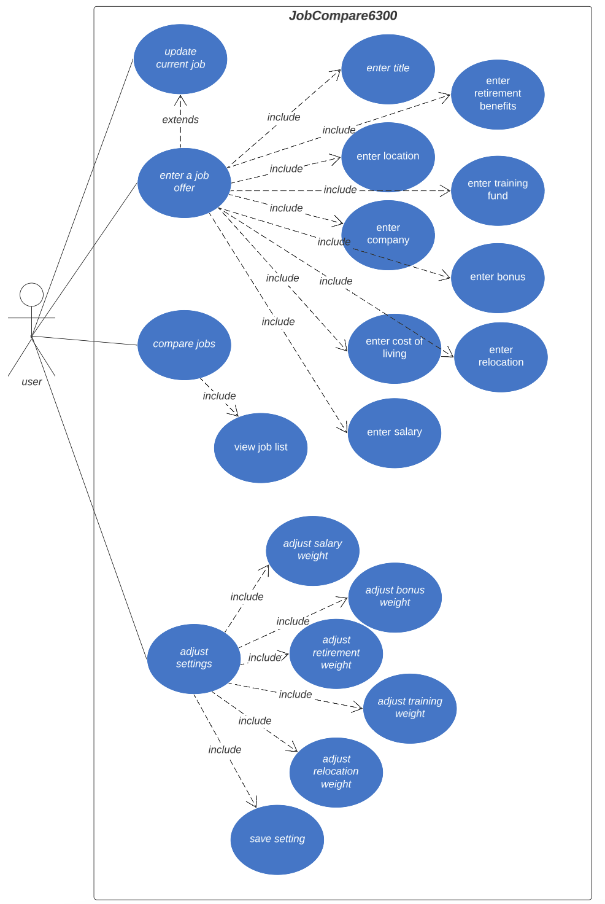

# Use Case Model

Author: \<SeGe Jung\>

## 1 Use Case Diagram

## 2 Use Case Descriptions

1. Update current job
- Requirements: this allows users to update/edit current job details
- Pre-conditions: this is only accessible via the main UI
- Post-conditions: job detail should be either saved or discarded
- Scenarios:
    - User clicks on update job button
    - User edits details
    - User saves the detail    

2. Enter a job offer
- Requirements: this allows users to enter a new job offer
- Pre-conditions: this is accessible via the main UI
- Post-conditions: job offer must be created and added to a job list
- Scenarios:
    - User clicks on enter a job offer
    - User enters job details
    - User saves job 

3. Compare jobs
- Requirements: this allows users to compare jobs
- Pre-conditions: Must be at least two jobs entered to compare
- Post-conditions: user will see a list of jobs with scores
- Scenarios:
    - User clicks compare job
    - User views a list of jobs with score    

4. Adjust settings
- Requirements: this allows users to adjust weight settings for the equation
- Pre-conditions: this is accessible via the main UI
- Post-conditions: changed setting should be changed and reflected in the job compare
- Scenarios:
    - User clicks adjust settings
    - User changes weights
    - User clicks save
    - User views new score in the job compare 
